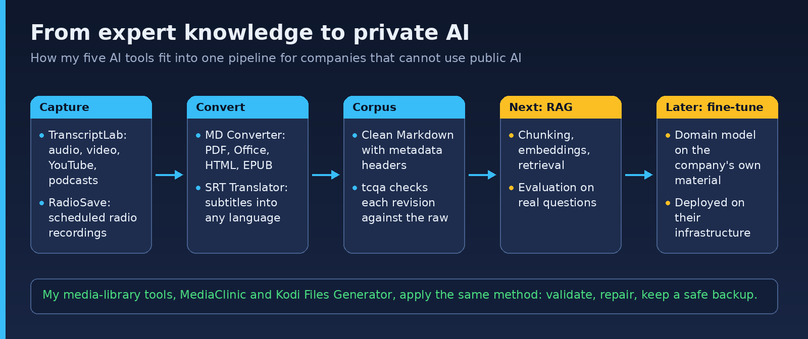
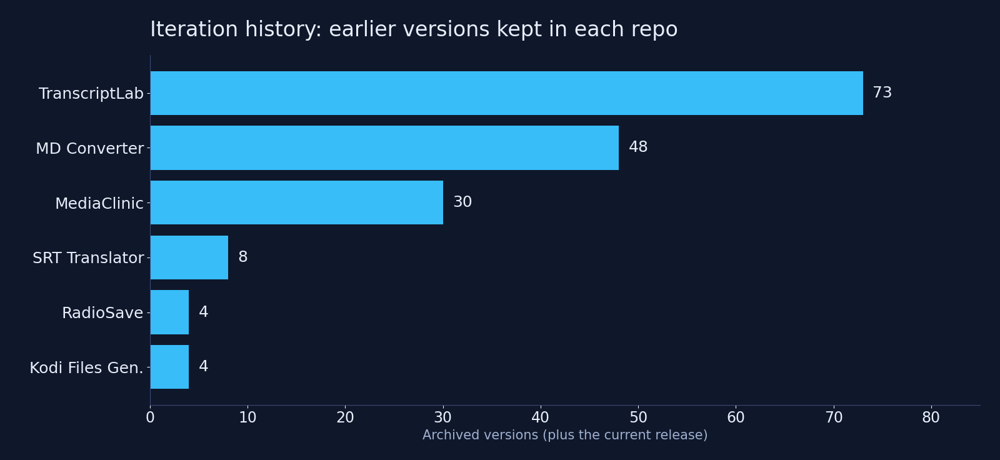

# Hi, I'm Luiz Junqueira 👋

**Infrastructure & renewable energy investment professional (20+ years, PMP) who builds private, local-first AI tools.**
Zürich, Switzerland · [junqueira.ch](https://www.junqueira.ch) · [LinkedIn](https://www.linkedin.com/in/luizjunqueira/)

I have spent two decades developing, financing and delivering hydropower, solar and gas assets across Latin America, Africa and Europe. Today I combine that domain knowledge with hands-on AI engineering.

## What I'm working on

**Turning expert knowledge into private AI.** Energy and infrastructure companies hold know-how and trade secrets they cannot paste into a public chatbot. I am building the pipeline to make that knowledge usable by AI *on their own infrastructure*:

`recordings / PDFs / documents` → **clean Markdown corpus** → **verified revision** ([tcqa](https://github.com/junqueirach/transcript-corpus-qa)) → **RAG** (retrieval-augmented generation) → *later:* **fine-tuning** a model on the company's own material

## Projects

All tools were built with Claude (Anthropic) as coding partner. I write the requirements, test on real data and iterate. Every earlier version is kept in each repo's `archive/` folder.

| Project | What it does | Size |
|---|---|---|
| [**TranscriptLab**](https://github.com/junqueirach/transcriptlab) | Whisper transcription, YouTube/podcast capture and Markdown polishing into a RAG-ready corpus | ~27k lines, 70+ versions |
| [**MD Converter**](https://github.com/junqueirach/md-converter) | PDF/Office/HTML/EPUB to Markdown with 6+ local engines, isolated environments and smoke tests | ~5k lines, 45+ versions |
| [**tcqa**](https://github.com/junqueirach/transcript-corpus-qa) | Offline fidelity checker: proves a corrected speech-to-text transcript changed only what its log says, before the text enters a RAG or fine-tuning corpus | 14 checks, 203 tests, CI on Ubuntu and Windows |
| [**MediaClinic**](https://github.com/junqueirach/mediaclinic) | Kodi library health tool, built under a written AI-engineering contract (`CLAUDE_RULES.md`) | ~12k lines, 30 versions |
| [**RadioSave**](https://github.com/junqueirach/radiosave) | Scheduled radio recorder for unattended 24/7 machines | ~3.7k lines |
| [**SRT Translator**](https://github.com/junqueirach/srt-translator) | Structure-preserving subtitle translation with Claude | GUI + CLI |
| [**Kodi Files Generator**](https://github.com/junqueirach/kodi-files-generator) | CSV to Kodi NFO/XML generator with rename checker | |

## How I work with AI

- Write a clear brief first, then iterate in small versioned steps
- Give the AI rules it must obey (module boundaries, naming, safety checklists)
- Test on real data, log everything, fix the root cause
- Keep the history public
- Keep confidential data local and secrets out of the code

## Tech

Python · Tkinter · Whisper · MarkItDown · Docling · ffmpeg · yt-dlp · Claude API · Markdown pipelines · RAG concepts

## Get in touch

Open to senior roles in infrastructure and renewables, and to conversations about private AI for energy companies.
📧 junqueira.ch@gmail.com · 🌐 [junqueira.ch](https://www.junqueira.ch)
